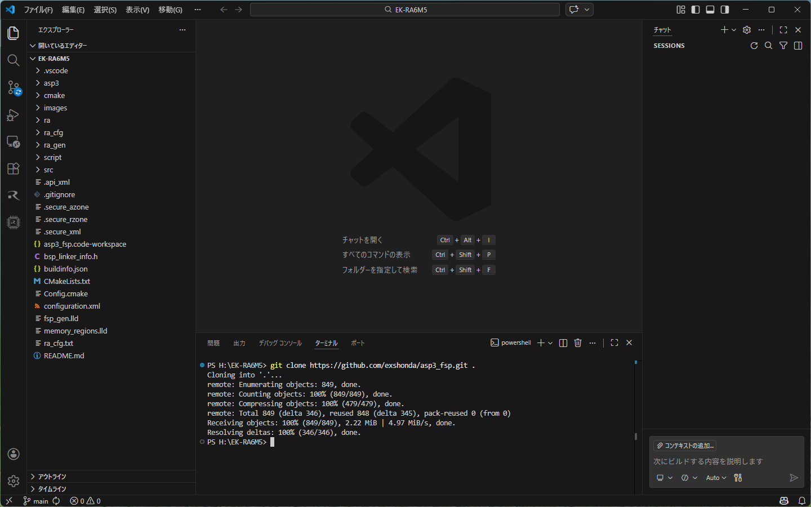
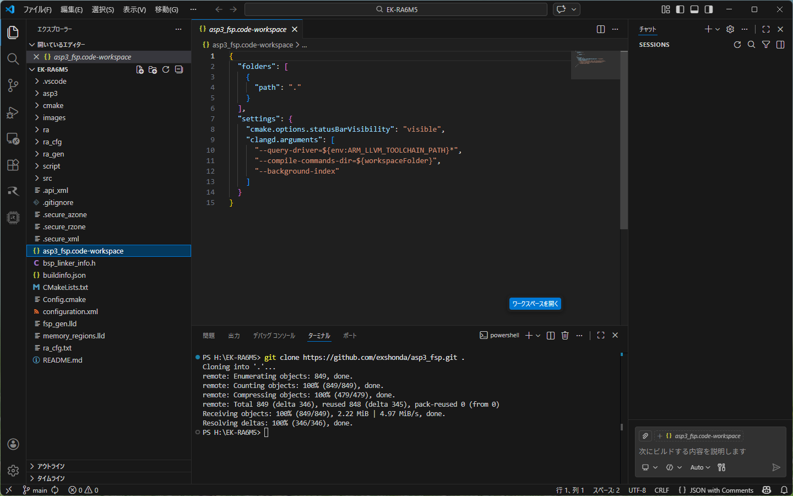
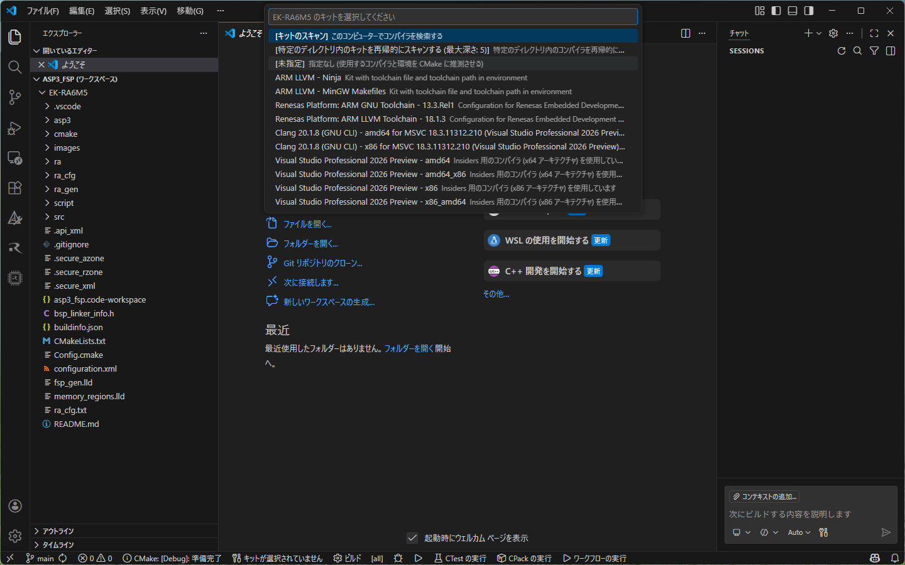
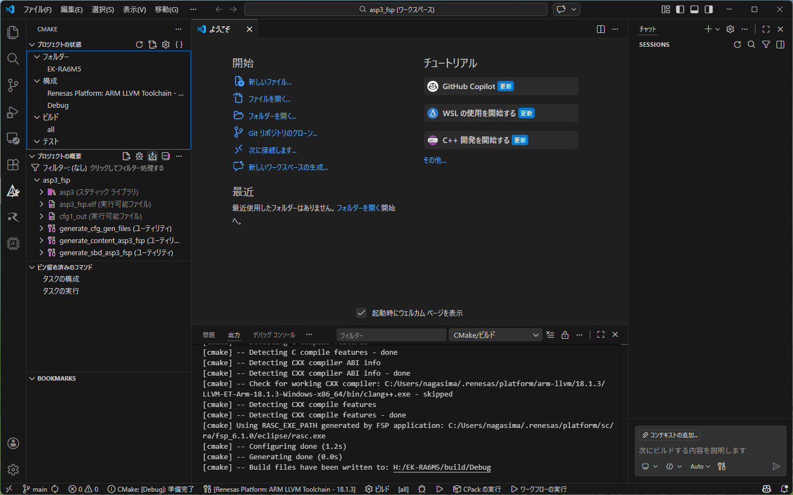
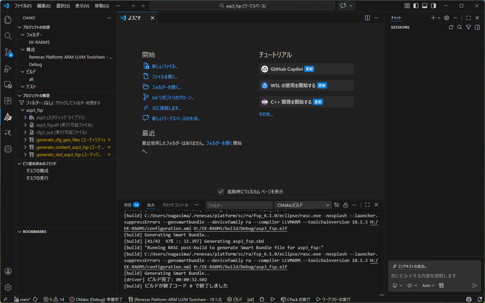
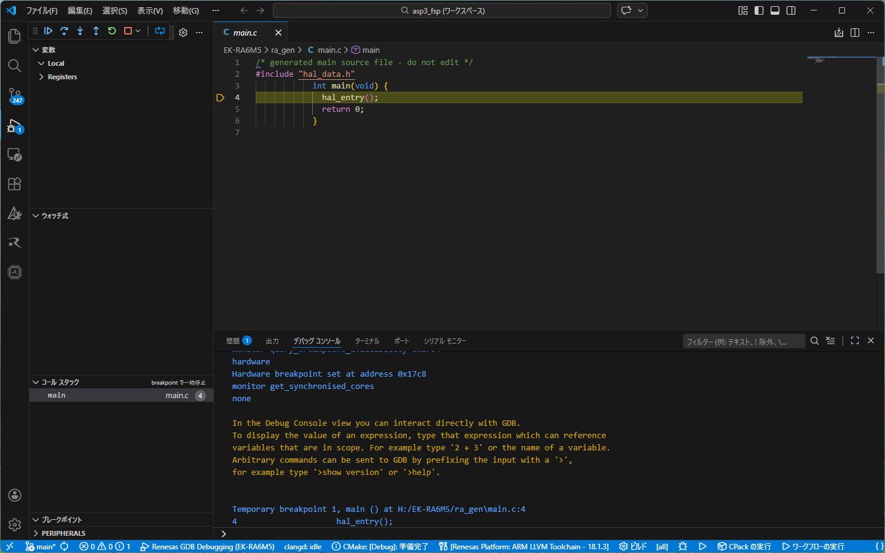
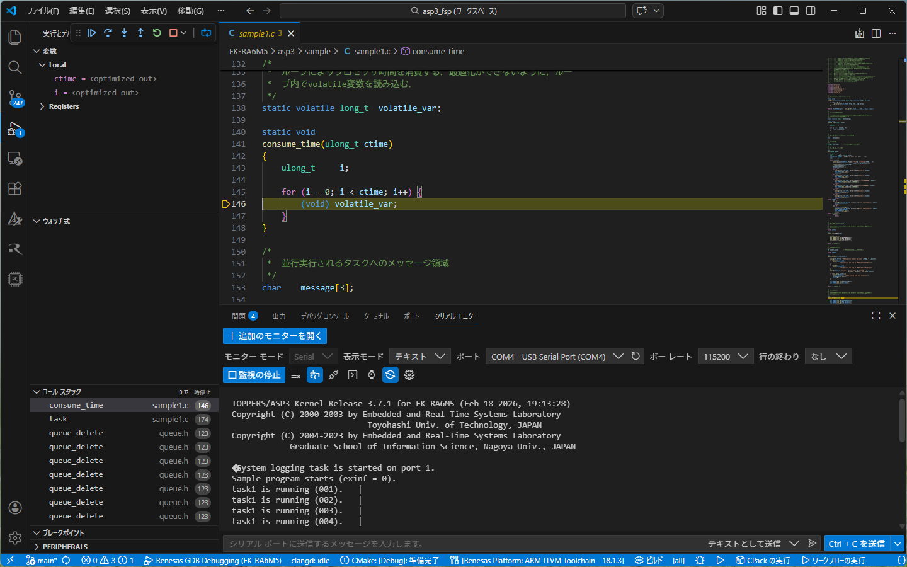

# TOPPERS/ASP3の VS code向けのRenesas拡張機能対応

## ターゲット
- [EK-RA6M5](https://www.renesas.com/ja/design-resources/boards-kits/ek-ra6m5?srsltid=AfmBOooxOIRvtPF3k4PRvCM5RuOCfogtJXSP6W-tii1L4Szs8DY4t46m)

## Renesas拡張機能のインストール

左領域にある「拡張機能」アイコンを選択し、「Marketplaceで拡張機能を検索する」に「Renesas」と入力して、Renesas拡張機能をインストールします。


「QUICK INSTALL」で「Renesas RA」のツールチェインなど一式をインストールします。
このプロジェクトは「Renesas Platform: ARM LLVM Toolchain - 18.1.3」で作成しています。


## コードのダウンロード



適当な場所に作業フォルダを作成し、そこをVSCodeで開きます。「Ctrl + Shift + @」でターミナルを開き、下記のコマンドを実行してコードをダウンロードします。

```powershell
git clone https://github.com/exshonda/asp3_fsp.git .
```

## ワークスペースを開く



左領域にあるエクスプローラビューにある`asp3_fsp.code-workspace`を選択し、「ワークスペースを開く」ボタンをクリックすると、ワークスペースが開かれCMakeの構成が行われます。



構成が終わるとツールチェンの選択項目が表示されるので、「Renesas Platform: ARM LLVM Toolchain - 18.1.3」を選択します。（このプロジェクト作成時のツールチェンです。）

## プロジェクトのビルド



メニューから「ターミナル」->「タスクの実行」->「Build Project」を選択します。

下記のエラーが出た場合、「ターミナル」->「タスクの実行」->「Configure Project」を選択し、再びビルドします。

```text
Components have been added to, or removed from the project. Build may fail until the project is refreshed in your IDE.
```



## EK-RA6M5に接続してデバッグ

EK-RA6M5のデバッグUSBポートとPCを接続し、USBシリアルと、RX(pin0)、TX(pin1)、GND(pin14)を接続して、TeraTermなどでシリアル接続します。ボーレートは115200bpsです。



左領域にある「実行とデバッグ」アイコンを選択し、「デバッグの開始」ボタンをクリックします。
`main`で停止しますので、「実行」ボタンで実行します。



シリアルポートからTOPPERSのバナーが表示され、サンプル１の動作が始まります。
