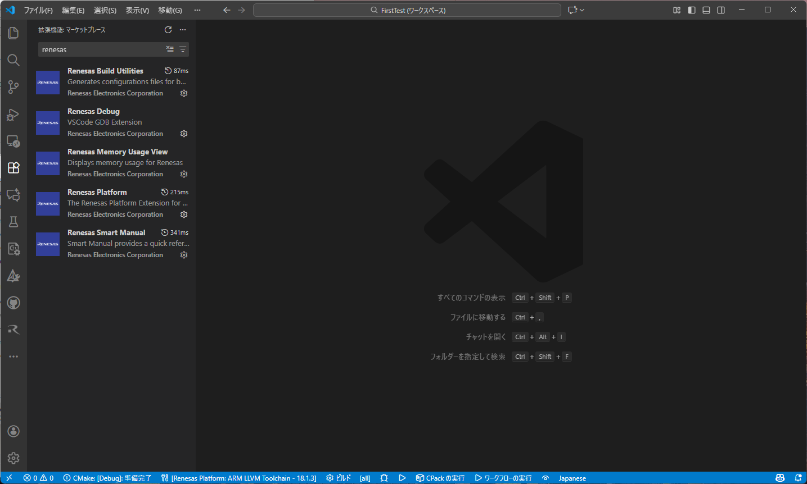
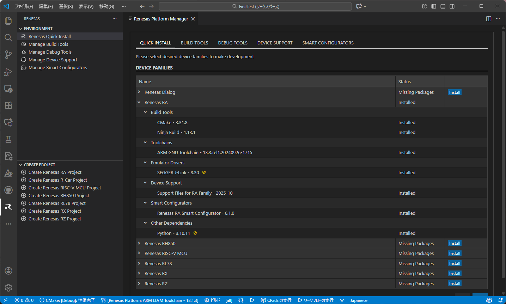

# ASP3 FSP

TOPPERS/ASP3 と Renesas FSP を組み合わせたサンプルプロジェクトです。

TOPPERS/ASP3 RTOS 上で動く `sample1` タスクが UART にバナーとメッセージを出力するサンプルが動作します。
このリポジトリを通じて以下を学べます。

- Renesas FSP (Flexible Software Package) と TOPPERS/ASP3 RTOS の連携方法
- VS Code + CMake + Renesas 拡張によるクロスコンパイル環境の構築
- ASP3 のタスク・セマフォ・サービスコールの基本的な使い方

## フォルダ構成

- `asp3/`: 共通の TOPPERS/ASP3 RTOS 本体
- `ek_ra6m5/`: EK-RA6M5 向けのボードフォルダ
- `ek_ra6m5/sample/`: EK-RA6M5 のサンプルアプリケーション
- `ek_ra8m2/`: EK-RA8M2 向けのボードフォルダ
- `ek_ra8m2/sample/`: EK-RA8M2 のサンプルアプリケーション

各 `sample/` ディレクトリを CMake・VS Code・Smart Configurator のアプリケーションルートとして扱います。

## Renesas拡張機能のインストール

左領域にある「拡張機能」アイコンを選択し、「Marketplaceで拡張機能を検索する」に「Renesas」と入力して、Renesas拡張機能をインストールします。



「QUICK INSTALL」で「Renesas RA」のツールチェインなど一式をインストールします。
このプロジェクトは「Renesas Platform: ARM LLVM Toolchain - 18.1.3」で作成しています。



## サンプルの開き方

使用するボードに合わせて、対応する README を参照してください。

| ボード | 詳細手順 | ワークスペース |
|--------|----------|----------------|
| EK-RA6M5 | [ek_ra6m5/sample/README.md](ek_ra6m5/sample/README.md) | `ek_ra6m5/sample/asp3_fsp.code-workspace` |
| EK-RA8M2 | [ek_ra8m2/sample/README.md](ek_ra8m2/sample/README.md) | `ek_ra8m2/sample/asp3_fsp.code-workspace` |

## 新規プロジェクト作成ガイド

既存の `sample/` ディレクトリを雛形として新しいアプリケーションを作成できます。

### 最小複製対象

いずれかの `sample/` ディレクトリを丸ごとコピーし、以下のファイルを編集します。

```
sample/
├── CMakeLists.txt          ← アプリ名・ソースファイルを変更
├── Config.cmake            ← 必要に応じてパスを変更
├── configuration.xml       ← Smart Configurator で再生成
└── .vscode/                ← そのまま流用可（kit は再選択）
    ├── cmake-kits.json
    ├── launch.json
    └── tasks.json
```

> `ra/`・`ra_gen/`・`ra_cfg/`・`cmake/`・`script/` は Smart Configurator が自動生成するため、コピー不要です。`configuration.xml` を開いて「Generate Project Content」を実行すると再生成されます。

### CMakeLists.txt の変更点

新しいアプリ用に変更が必要な箇所は3点です。

```cmake
# (1) ターゲットボード名 — asp3/target/ 以下のディレクトリ名に合わせる
#     EK-RA6M5 なら ek_ra6m5、EK-RA8M2 なら ek_ra8m2
set(ASP3_TARGET ek_ra6m5)

# (2) タスク・セマフォなどカーネルオブジェクトを定義する .cfg ファイルのパス
#     asp3/sample/sample1.cfg を参考に自分のアプリ用 .cfg を作成して指定する
set(ASP3_APP_CFG_FILE ${ASP3_ROOT_DIR}/sample/sample1.cfg)

# (3) アプリのソースファイル — 自分の .c ファイルに置き換える
target_sources(${CMAKE_PROJECT_NAME}.elf PRIVATE
    ${ASP3_ROOT_DIR}/sample/sample1.c
)
```

### sample1 を自作アプリに置き換える具体例

`sample1` を `myapp` という名前のアプリに置き換える場合の手順です。

1. `asp3/sample/sample1.c` と `asp3/sample/sample1.cfg` を参考に、`src/myapp.c` と `src/myapp.cfg` を作成します。
2. `CMakeLists.txt` を以下のように変更します。

```cmake
# (2) .cfg ファイルを自分のものに変更
set(ASP3_APP_CFG_FILE ${CMAKE_CURRENT_LIST_DIR}/src/myapp.cfg)

list(APPEND ASP3_INCLUDE_DIRS
    ${CMAKE_CURRENT_LIST_DIR}/src   # myapp.cfg から参照するヘッダのディレクトリ
)

# (3) ソースファイルを自分のものに変更
target_sources(${CMAKE_PROJECT_NAME}.elf PRIVATE
    ${CMAKE_CURRENT_LIST_DIR}/src/myapp.c
)
```

3. Smart Configurator で `configuration.xml` を開き「Generate Project Content」を実行します。
4. VS Code のタスク「Build Project」でビルドします。
